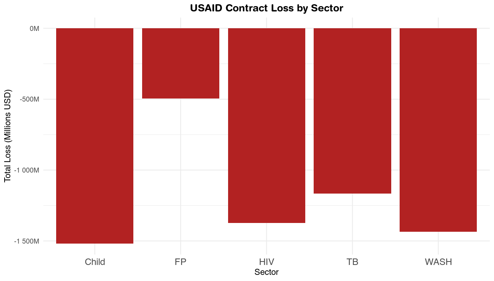
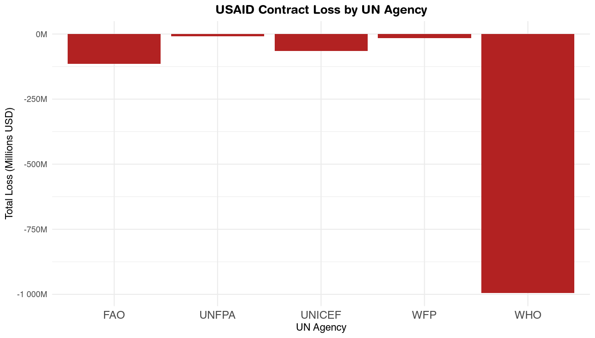

# USAID Funding Cuts Spreadsheet
The Trump administration delivered a 281-page spreadsheet that lists terminated and active USAID programs. This was reported first by the [New York Times](https://www.nytimes.com/2025/03/26/health/usaid-cuts-gavi-bird-flu.html) and accounts for billions of dollars of fundings. I had not been able to find an analysis ready dataset. Here it is:

 Column Mapping (Original Spreadsheet -> Standardized Variable Name):
  
 -  "Vendor Name"              -> vendor
 -  "Contract Description"     -> contract
 -  "Total Estimated Cost"     -> estimated_cost
 -  "Obligated Amount"         -> obligated_amount
 -  "Contract State Date"      -> start_date
 -  "Contract End Date"        -> end_date
 -  "Issuing Office"           -> issuing_office
 -  "type"                     -> type (no change): funded or defunded

The data are available as a tab-separated file (.tsv), a Excel spreadsheet (.xlsx) and an RData file (.RData).

I conducted a quick analysis of the data. First I looked at the loss by sector: HIV, TB, Family Planning (FP), WASH, and Child. This analysis used the key_words_in_aid.R script. The different sectors may double count funding. For instance, if a contract was described as "HIV/TB", the loss would appear against HIV and TB.

Second I looked at the loss by UN Agency: UNFPA, UNICEF, FAO, WFP, and WHO. This analysis used the vendor_words_in_aid.R script. There sould not be any double counting across UN agency.

